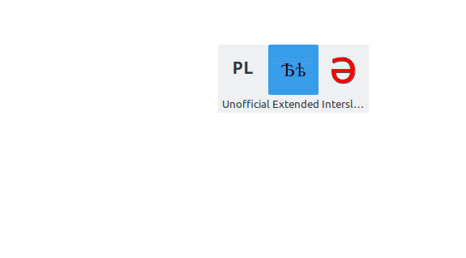
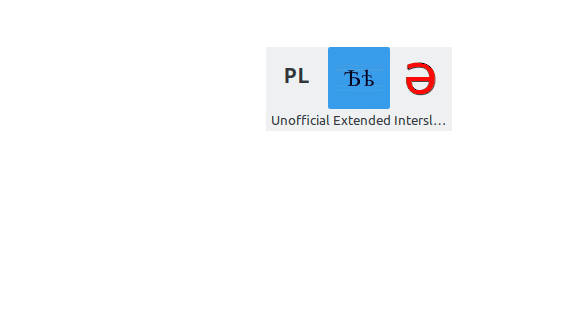

## Unofficial Interslavic Ext. Cyrillic keyboard layout



### Building and installation

To install this on your system you need `ibus` as your input method and `ibus-table` engine installed (packages `ibus` and `ibus-table` on Debian/Ubuntu-based distros).

If you have `ibus-table` installed, clone the repo and change directory to it:

```
$ git clone git@gitlab.com:silmeth/ms-cyrillic-ibus-table.git
$ cd ms-cyrillic-ibus-table
```

then run as a root:
```
sudo ibus-table-createdb -n /usr/share/ibus-table/tables/interslavic-cyrillic.db -s ./interslavic-cyrillic.txt
```

and copy the icon to ibus icons dir:
```
sudo cp ./Cyrillic_letter_Yat.svg /usr/share/ibus-table/icons/
```

Finally restart `ibus`:
```
ibus-restart
```
and you should be done and ready to choose this layout in your `ibus-config`.

### Usage


This is a table-based layout using the same input method that many languages of East Asia use:
you type in Latin characters and they get converted to characters of the other writing system.

Here, many Latin letters get converted 1-to-1 to their equivalent Cyrillic characters, but if there
is some ambiguity, a list of possible candidates is present from which you may choose
(using the 1–9 keys, or arrows) the one you need, eg. if you type in ‘i’, you’ll be displayed:

```
i (1/2)
1. і
2. и
```

You can use Polish-type orthography or characters with hačeks, if your default layout supports them,
to input ш (`sz`, `š`, `sx`), ч (`cz`, `č`, `cx`), щ (`szcz`, `šč`, `sxcx`), ж (`zs`, `zx`, `ż`, `ž`), etc.

Hačeks on other letters are also supported, eg. `ň` will allow you to input нь and њ.

A subset of Old Cyrillic letters is also available – to write ѣ type `` je` ``, to write ѧ, ѫ, ѩ, ѭ type `e~, u~, je~, ju~`
(or, if your default keyboard layout have them, `ę, ą, ǫ, ų, ję, ją, jǫ, jų`, etc. are also supported.
For old yotted letters ѥ, ꙗ, ю type `|e, |a, |o` or `` je`, ja`, ju ``, etc.

You can commit some characters earlier to stop them from combining into other characters, eg to write језык type `j.ezyk`,
to write шчасце type `sz.czasce`.

To temporarily turn off the table-based input method (and use your default layout instead) hit Left Shift once,
to go back to writing in Cyrillic, hit Left Shift again.

### Acknowledgements

This layout is heavily inspired by the 
[`ibus-table-ipa-x-sampa`](https://github.com/moebiuscurve/ibus-table-others/blob/master/tables/ipa-x-sampa.txt) layout.

The icon the non-copyrighted [`Cyrillic letter Yat.svg](https://commons.wikimedia.org/wiki/File:Cyrillic_letter_Yat.svg)
file from Wikimedia Commons.

